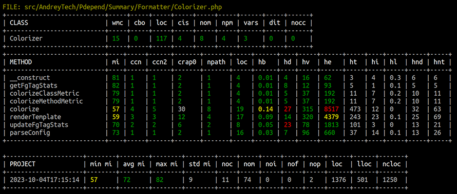

# Pdepend Summary Formatter



[](https://packagist.org/packages/andrey-tech/pdepend-summary-formatter-php)
[](https://packagist.org/packages/andrey-tech/pdepend-summary-formatter-php)
[](https://packagist.org/packages/andrey-tech/pdepend-summary-formatter-php)

Pdepend Summary Formatter is a tool to show software code quality metrics, measured by
[PHP Depend](https://github.com/pdepend/pdepend) (pdepend),
in console for development and in CI/CD pipeline.

## Table of contents
<!-- MarkdownTOC levels="1,2,3,4,5,6" autoanchor="true" autolink="true" -->

- [Installation](#installation)
- [Command line options](#command-line-options)
- [Software metrics](#software-metrics)
- [Configuration YAML file](#configuration-yaml-file)
- [Exit codes](#exit-codes)
- [Authors and Maintainers](#authors-and-maintainers)
- [License](#license)

<!-- /MarkdownTOC -->

<a id="installation"></a>
## Installation

Pdepend Summary Formatter tool requires **PHP >= 7.4**, 
latest version of [PHP Depend](https://github.com/pdepend/pdepend) 
and [Composer](https://getcomposer.org/).

```shell
composer require --dev pdepend/pdepend:"^2.15"
composer require --dev andrey-tech/pdepend-summary-formatter-php
```

Generate a default config file `pdepend-summary-formatter.yml.dist` in current working directory:

```shell
./vendor/bin/pdepend-summary-formatter --init
```

Then run `PHP Depend` to scan your source PHP-code in directory `src` and generate an XML report in file `summary.xml`:

```shell
./vendor/bin/pdepend --summary-xml=summary.xml --suffix=php src
```

Then run Pdepend Summary Formatter tool to show code quality metrics,
measured by PHP Depend, in console and write results to specified text file `summary.txt`:

```shell
./vendor/bin/pdepend-summary-formatter summary.xml --output-file=summary.txt
```

<a id="command-line-options"></a>
## Command line options

```shell
./vendor/bin/pdepend-summary-formatter <path to pdepend file summary.xml>
```

The command line interface also accepts the following optional arguments:

- `--init` - Will generate a default config file `pdepend-summary-formatter.yml.dist` in current working directory.
- `--output-file=` - Write results also to the specified text file.
- `--config-file=` - The filepath to a custom config YAML file.
- `--no-colors` - Disable colors in console.

An example command line of Pdepend Summary Formatter tool and PHP Depend tool:

```shell
./vendor/bin/pdepend --summary-xml=./var/summary.xml --suffix=php src,tests
./vendor/bin/pdepend-summary-formatter ./var/summary.xml --config-file=./pdepend-summary-formatter.yml --output-file=./var/summary.txt
```

An example of output text file `summary.txt`:

```text
FILE: src/AndreyTech/Pdepend/Summary/Formatter/Colorizer.php
+---------------------------+-----+-----+-----+-----+-----+-----+------+-----+------+
| CLASS                     | wmc | cbo | loc | cis | nom | npm | vars | dit | nocc |
+---------------------------+-----+-----+-----+-----+-----+-----+------+-----+------+
| Colorizer                 | 15  | 0   | 117 | 4   | 8   | 4   | 3    | 0   | 0    |
+---------------------------+-----+-----+-----+-----+-----+-----+------+-----+------+
+---------------------------+----+-----+------+-------+-------+-----+------+----+-----+------+-----+----+-----+-----+-----+
| METHOD                    | mi | ccn | ccn2 | crap0 | npath | loc | hb   | hd | hv  | he   | ht  | hi | hl  | hnd | hnt |
+---------------------------+----+-----+------+-------+-------+-----+------+----+-----+------+-----+----+-----+-----+-----+
| __construct               | 81 | 1   | 1    | 2     | 1     | 4   | 0.01 | 4  | 16  | 62   | 3   | 4  | 0.3 | 6   | 6   |
| getFgTagStats             | 82 | 1   | 1    | 2     | 1     | 4   | 0.01 | 8  | 12  | 93   | 5   | 1  | 0.1 | 5   | 5   |
| colorizeClassMetric       | 79 | 1   | 1    | 2     | 1     | 4   | 0.01 | 5  | 37  | 192  | 11  | 7  | 0.2 | 10  | 11  |
| colorizeMethodMetric      | 79 | 1   | 1    | 2     | 1     | 4   | 0.01 | 5  | 37  | 192  | 11  | 7  | 0.2 | 10  | 11  |
| colorize                  | 57 | 4   | 5    | 30    | 8     | 19  | 0.14 | 27 | 315 | 8517 | 473 | 12 | 0   | 32  | 63  |
| renderTemplate            | 59 | 3   | 3    | 12    | 4     | 17  | 0.09 | 14 | 320 | 4379 | 243 | 23 | 0.1 | 25  | 69  |
| updateFgTagStats          | 70 | 2   | 2    | 6     | 2     | 8   | 0.05 | 23 | 78  | 1813 | 101 | 3  | 0   | 13  | 21  |
| parseConfig               | 73 | 1   | 1    | 2     | 1     | 16  | 0.03 | 7  | 96  | 660  | 37  | 14 | 0.1 | 13  | 26  |
+---------------------------+----+-----+------+-------+-------+-----+------+----+-----+------+-----+----+-----+-----+-----+

+---------------------+--------+--------+--------+--------+-----+-----+-----+-----+-----+------+------+-------+
| PROJECT             | min mi | avg mi | max mi | std mi | noc | nom | noi | nof | nop | loc  | lloc | ncloc |
+---------------------+--------+--------+--------+--------+-----+-----+-----+-----+-----+------+------+-------+
| 2023-10-04T17:15:14 | 57     | 72     | 82     | 9      | 11  | 74  | 0   | 0   | 2   | 1376 | 501  | 1250  |
+---------------------+--------+--------+--------+--------+-----+-----+-----+-----+-----+------+------+-------+
```

<a id="software-metrics"></a>
## Software metrics

[PHP Depend](https://pdepend.org/) (pdepend) tool can generate a large set of [software metrics](https://pdepend.org/documentation/software-metrics/index.html)
from a given code base, these values can be used to measure the quality of a software project 
and they help to identify that parts of an application where a refactoring should be applied.

Pdepend Summary Formatter tool shows only part of software metrics, measured by PHP Depend,
and colors them
(<span style="color: green">green</span>, <span style="color: yellow">yellow</span>, <span style="color: red">red</span>)
in the console according to boundaries for values, defined in configuration YAML file.

This table give a list of the software metrics, shows by Pdepend Summary Formatter tool
for entire project, classes, traits, methods,
and default values for <span style="color: red">red</span> boundaries of software metrics,
based on [PHP Mess Detector](https://phpmd.org/) (PHPMD) tool.

| Metric | Description                                                                                                                                                                                                                      | Project | Class | Trait | Method |
|--------|----------------------------------------------------------------------------------------------------------------------------------------------------------------------------------------------------------------------------------|---------|-------|-------|--------|
| avg mi | Average [Maintainability Index](https://learn.microsoft.com/en-us/visualstudio/code-quality/code-metrics-maintainability-index-range-and-meaning?view=vs-2022)                                                                   | 50      |       |       |        |
| cbo    | [Coupling Between Objects](https://phpmd.org/rules/design.html#couplingbetweenobjects)                                                                                                                                           |         | 13    | 13    |        |
| ccn    | [Cyclomatic Complexity Number](https://phpmd.org/rules/codesize.html#cyclomaticcomplexity)                                                                                                                                       |         |       |       | 10     |
| ccn2   | [Extended Cyclomatic Complexity Number](https://stackoverflow.com/questions/27954015/cyclomatic-complexity-and-variants)                                                                                                         |         |       |       | 10     |
| cis    | [Class Interface Size](https://phpmd.org/rules/codesize.html#excessivepubliccount)                                                                                                                                               |         | 45    | 45    |        |
| crap0  | [Change Risk Analysis and Predictions Index](https://www.artima.com/weblogs/viewpost.jsp?thread=210575) for 0% coverage                                                                                                          |         |       |       | 29     |
| dit    | [Depth of Inheritance Tree](https://phpmd.org/rules/design.html#depthofinheritance)                                                                                                                                              |         | 6     |       |        |
| hb     | [Halstead Bugs](https://en.wikipedia.org/wiki/Halstead_complexity_measures)                                                                                                                                                      |         |       |       | 0.19   |
| hd     | [Halstead Difficulty](https://en.wikipedia.org/wiki/Halstead_complexity_measures)                                                                                                                                                |         |       |       | 20     |
| he     | [Halstead Effort](https://en.wikipedia.org/wiki/Halstead_complexity_measures)                                                                                                                                                    |         |       |       | 5000   |
| hi     | [Halstead Intelligence Content](https://en.wikipedia.org/wiki/Halstead_complexity_measures)                                                                                                                                      |         |       |       | ✓      |
| hl     | [Halstead Level](https://en.wikipedia.org/wiki/Halstead_complexity_measures)                                                                                                                                                     |         |       |       | ✓      |
| hnd    | [Halstead Vocabulary](https://en.wikipedia.org/wiki/Halstead_complexity_measures)                                                                                                                                                |         |       |       | ✓      |
| hnt    | [Halstead Length](https://en.wikipedia.org/wiki/Halstead_complexity_measures)                                                                                                                                                    |         |       |       | ✓      |
| ht     | [Halstead Programming Time](https://en.wikipedia.org/wiki/Halstead_complexity_measures)                                                                                                                                          |         |       |       | ✓      |
| hv     | [Halstead Volume](https://en.wikipedia.org/wiki/Halstead_complexity_measures)                                                                                                                                                    |         |       |       | 500    |
| lloc   | Logical Lines Of Code                                                                                                                                                                                                            | ✓       |       |       |        |
| loc    | [Lines Of Code](https://phpmd.org/rules/codesize.html#excessivemethodlength)                                                                                                                                                     |         | 1000  |       | 100    |
| max mi | Maximum of [Maintainability Index](https://learn.microsoft.com/en-us/visualstudio/code-quality/code-metrics-maintainability-index-range-and-meaning?view=vs-2022)                                                                | 50      |       |       |        |
| mi     | [Maintainability Index](https://learn.microsoft.com/en-us/visualstudio/code-quality/code-metrics-maintainability-index-range-and-meaning?view=vs-2022)                                                                           |         |       |       | 50     |
| min mi | Minimum of [Maintainability Index](https://learn.microsoft.com/en-us/visualstudio/code-quality/code-metrics-maintainability-index-range-and-meaning?view=vs-2022)                                                                | 50      |       |       |        |
| nocc   | [Number Of Child Classes](https://phpmd.org/rules/design.html#numberofchildren)                                                                                                                                                  |         | 15    |       |        |
| ncloc  | Non Comment Lines Of Code                                                                                                                                                                                                        | ✓       |       |       |        |
| noc    | Number Of Classes                                                                                                                                                                                                                | ✓       |       |       |        |
| nof    | Number Of Functions                                                                                                                                                                                                              | ✓       |       |       |        |
| noi    | Number Of Interfaces                                                                                                                                                                                                             | ✓       |       |       |        |
| nom    | [Number Of Methods](https://phpmd.org/rules/codesize.html#toomanymethods)                                                                                                                                                        |         | 25    |       |        |
| npm    | [Number of Public Methods](https://phpmd.org/rules/codesize.html#toomanypublicmethods)                                                                                                                                           |         | 10    | 10    |        |
| npath  | [NPath Complexity](https://phpmd.org/rules/codesize.html#npathcomplexity)                                                                                                                                                        |         |       |       | 200    |
| nop    | Number of Packages (namespaces)                                                                                                                                                                                                  | ✓       |       |       |        |
| std mi | [Standard deviation](https://en.wikipedia.org/wiki/Standard_deviation) of [Maintainability Index](https://learn.microsoft.com/en-us/visualstudio/code-quality/code-metrics-maintainability-index-range-and-meaning?view=vs-2022) | ✓       |       |       |        |
| vars   | [Number of Properties](https://phpmd.org/rules/codesize.html#toomanyfields)                                                                                                                                                      |         | 15    | 15    |        |
| wmc    | [Weighted Method Count](https://phpmd.org/rules/codesize.html#excessiveclasscomplexity)                                                                                                                                          |         | 50    | 50    |        |

Note: ✓ - means there are no defined color boundaries for this metric.

<a id="configuration-yaml-file"></a>
## Configuration YAML file

By default Pdepend Summary Formatter search following configuration YAML files is current working directory:
- `pdepend-summary-formatter.yml`,
- `pdepend-summary-formatter.yml.dist`.

Configuration YAML file allow to set color boundaries for values of software metrics.

Pdepend Summary Formatter tool currently defines three color boundaries:

| Color                                     | Description |
|-------------------------------------------|-------------|
| <span style="color: green">green</span>   | Ok          |
| <span style="color: yellow">yellow</span> | Warning     |
| <span style="color: red">red</span>       | Error       |

A white value means there are no defined color boundaries for this metric.

> You can also add/set custom colors and styles.
> See [How to Color and Style the Console Output](https://symfony.com/doc/current/console/coloring.html) in Symfony console.

Fragment of default configuration file:  
```yaml
  metrics:

    # Metrics of class
    class:

      # https://learn.microsoft.com/en-us/visualstudio/code-quality/code-metrics-class-coupling?view=vs-2022
      # https://phpmd.org/rules/design.html#couplingbetweenobjects
      # https://pdepend.org/documentation/software-metrics/coupling-between-objects.html
      cbo:
        green: [ 0, 13 ],
        red+bold: [ 14, null ]

    # Metrics of method
    method:

      # https://learn.microsoft.com/en-us/visualstudio/code-quality/code-metrics-cyclomatic-complexity?view=vs-2022
      # https://phpmd.org/rules/codesize.html#cyclomaticcomplexity
      ccn:
        green: [ 1, 7 ]
        yellow+bold: [ 8, 10 ]
        red+bold: [ 11, null ]
```

<a id="exit-codes"></a>
## Exit codes

Pdepend Summary Formatter tool currently defines four different exit codes:

| Code | Description                                                                                                                             |
|------|-----------------------------------------------------------------------------------------------------------------------------------------|
| 0    | This exit code indicates that everything worked as expected, no "red" or "yellow" metrics exist.                                        |
| 1    | This exit code indicates that an exception occurred which has interrupted tool during execution.                                        |
| 2    | This exit code means that tool has processed the summary file without the occurrence of an error/exception, but "red" metrics exist.    |
| 3    | This exit code means that tool has processed the summary file without the occurrence of an error/exception, but "yellow" metrics exist. |

<a id="authors-and-maintainers"></a>
## Authors and Maintainers

The author and maintainer of Pdepend Summary Formatter tool is [andrey-tech](https://github.com/andrey-tech).

<a id="license"></a>
## License

This tool is licensed under the [MIT license](./LICENSE).
